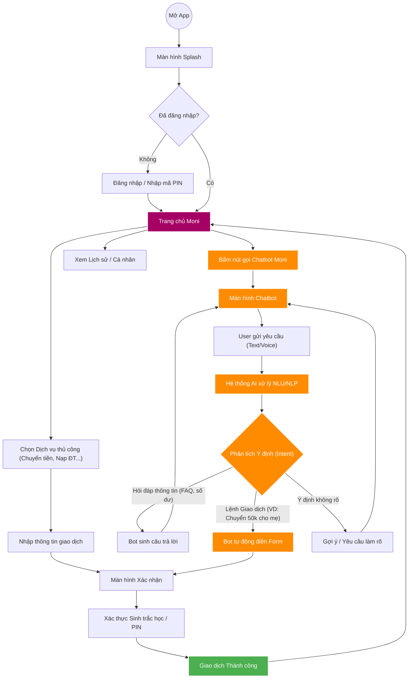

# Workflow Ứng dụng Moni (Super App & AI Chatbot)

Dưới đây là tài liệu mô tả luồng hoạt động (workflow) chi tiết cho prototype của ứng dụng Moni. Hệ thống được thiết kế theo mô hình siêu ứng dụng (giống MoMo) với tính năng cốt lõi là một Trợ lý ảo AI (Chatbot).

## Sơ đồ Luồng Người dùng (User Flow)

Sơ đồ dưới đây minh họa hành trình của người dùng từ lúc mở app đến khi thực hiện giao dịch thông thường hoặc qua Chatbot.

## Giải thích chi tiết các phân hệ

### 1. Phân hệ Xác thực & Trang chủ (Authentication & Home)
*   **Màn hình Splash & Login:** Ứng dụng kiểm tra trạng thái đăng nhập. Yêu cầu nhập PIN hoặc FaceID/TouchID để bảo mật.
*   **Trang chủ (Home):** Hiển thị số dư (có thể ẩn/hiện), các tính năng nổi bật (Chuyển tiền, QR Code), các banner khuyến mãi, và đặc biệt là một nút/icon nổi bật để gọi **Chatbot Moni**.

### 2. Phân hệ Giao dịch thủ công (Manual Flow)
Luồng tiêu chuẩn giống các ví điện tử truyền thống:
*   Người dùng tự tìm kiếm và chọn dịch vụ.
*   Tự điền các form thông tin (số điện thoại, số tiền, lời nhắn).
*   Xác nhận và xác thực thanh toán.

### 3. Phân hệ Trợ lý AI Moni (AI Chatbot Flow) - *Điểm nhấn của Prototype*
Đây là luồng tạo ra sự khác biệt cho ứng dụng của bạn:
*   **Giao diện Chat:** Tương tự như iMessage hoặc Messenger, nơi user có thể gõ phím hoặc ra lệnh bằng giọng nói.
*   **Xử lý Ngôn ngữ (NLP):** Khi user nhắn *"Nạp 100k vào số của anh Huy"*, AI sẽ tự động phân tích và trích xuất thực thể: Hành động = *Nạp tiền điện thoại*, Số tiền = *100.000*, Người nhận = *anh Huy (tìm trong danh bạ)*.
*   **Điều hướng thông minh:** Thay vì user phải tự thao tác 3-4 bước, Chatbot tự động nhảy thẳng đến **Màn hình Xác nhận giao dịch (ConfirmTx)** với mọi thông tin đã được điền sẵn.
*   **Hỏi đáp ngữ cảnh:** Chatbot có thể trả lời các câu hỏi như *"Tháng này tôi xài bao nhiêu tiền rồi?"* bằng cách truy xuất dữ liệu lịch sử và tổng hợp thành biểu đồ hoặc câu trả lời chữ.

> [!TIP]
> Đối với bản Prototype trên Vite/React sắp tới, chúng ta nên tập trung làm thật mượt **Màn hình Trang chủ** và nhánh **Luồng Chatbot Moni** (nhảy thẳng ra màn hình xác nhận) để gây ấn tượng mạnh nhất khi demo.
